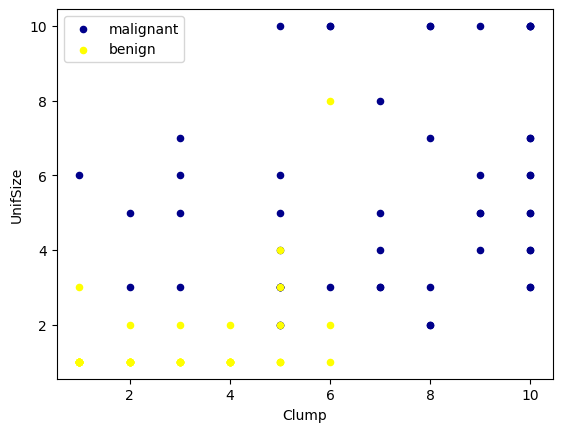
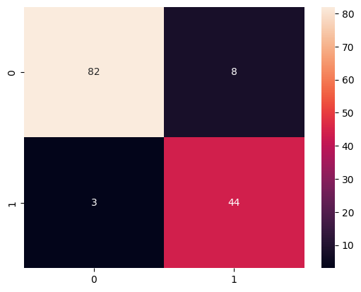
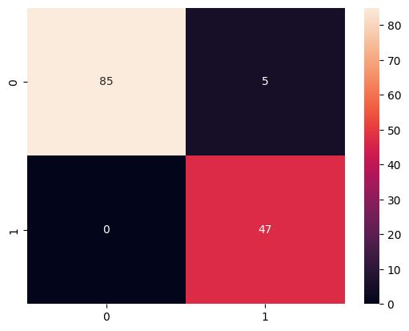
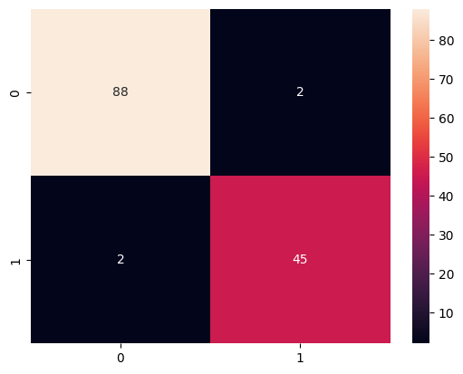
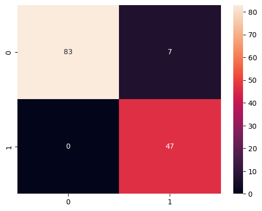

# Cancer_cell_detection
## Brief
This notebook demonstrates how to use machine learning to classify two types of cancer patients based on features given. The features are derived from the  Diagnostic Breast Cancer (WDBC) dataset from kaggle, which contains 698 samples of malignant and benign tumor cells. The features are computed from a digitized image of a fine needle aspirate (FNA) of a breast mass. They describe characteristics of the cell nuclei present in the image.
## NOTEBOOK CONTENT
The notebook consists of the following steps:

* Importing the necessary libraries and modules
* Loading and exploring the data
* Splitting the data into training and testing sets
* Building and training a logistic regression model
* Evaluating the model performance on the test set
* Visualizing the model coefficients and the decision boundary
  ## Libraries used
  The notebook requires the following libraries and modules:

* numpy
* pandas
* matplotlib
* seaborn
* sklearn
  ## Results and Data
  ***A peek in the dataset can be taken by the figure ploteed  below***
  </img>

  ### Confusion matrix
  #### Radom Forest
  </img>
   #### KNN
  </img>
   #### Logistic Regression
  </img>
   #### Support Vector MAchine
  </img>
   #### Descision Tree
  </img>
   #### SVC
  </img>
   #### NAvie Bayes
  </img>
  
  ## Thank you
  You can run the notebook on your local machine or on a cloud platform such as Google Colab or Kaggle. You can also download the dataset from the UCI Machine Learning Repository or use the built-in function from sklearn to load it.

I hope you find this notebook useful and informative. If you have any questions or feedback, please feel free to contact me. Thank you for your interest in this project. 😊
 # Demo (For Windows 8 | 10 | 11)
 * Download file from [here](https://github.com/Anshu05112004/Cancer_cell_detection/archive/refs/heads/main.zip)
  ## Contributing

Pull requests are welcome. For major changes, please open an issue first
to discuss what you would like to change.

Please make sure to update tests as appropriate.

## License

[MIT](https://choosealicense.com/licenses/mit/)
 
 ## Author
  
  [Anshu05112004](http://github.com/Anshu05112004)
